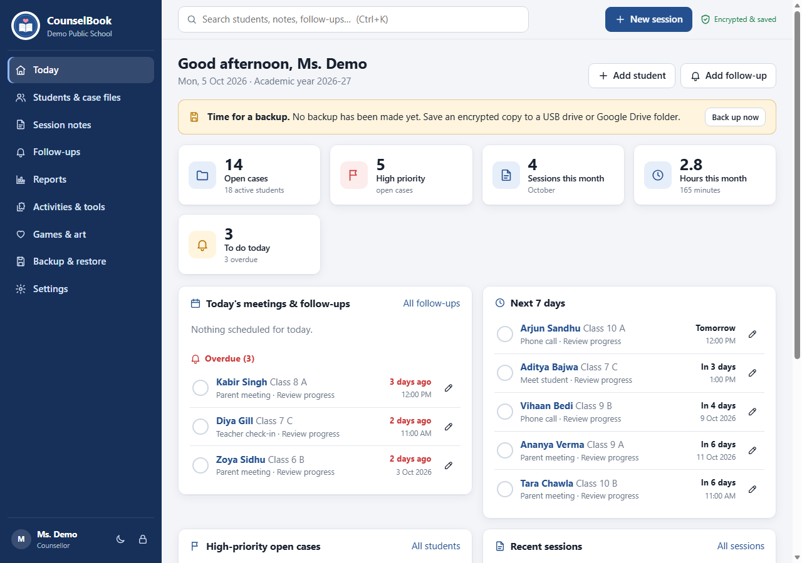
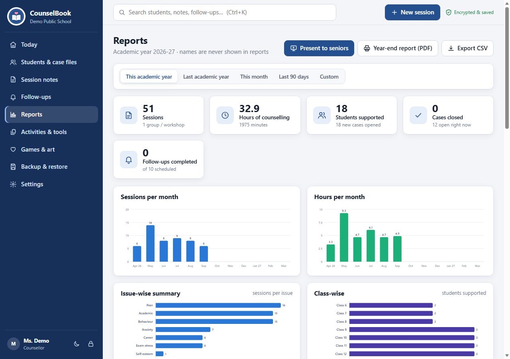
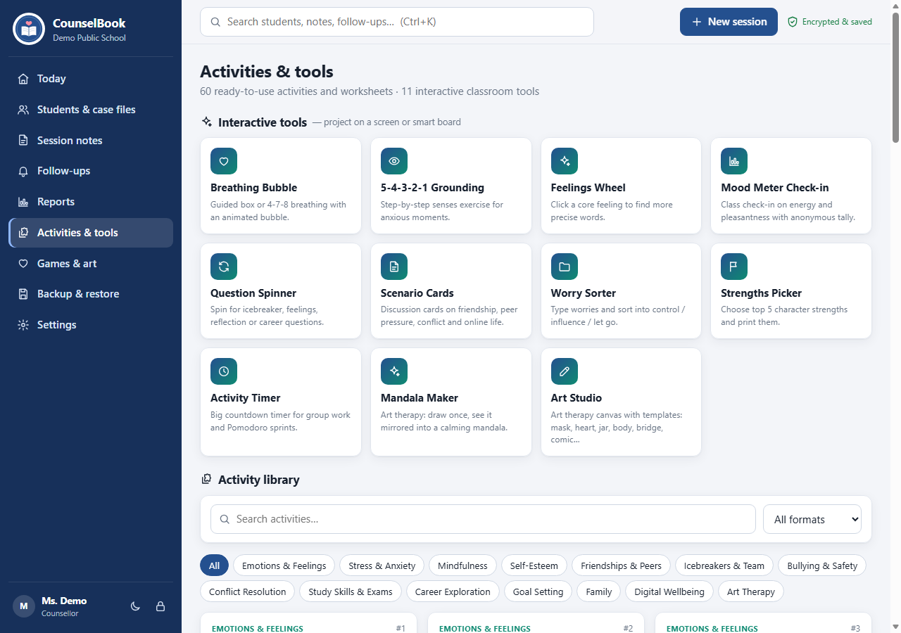
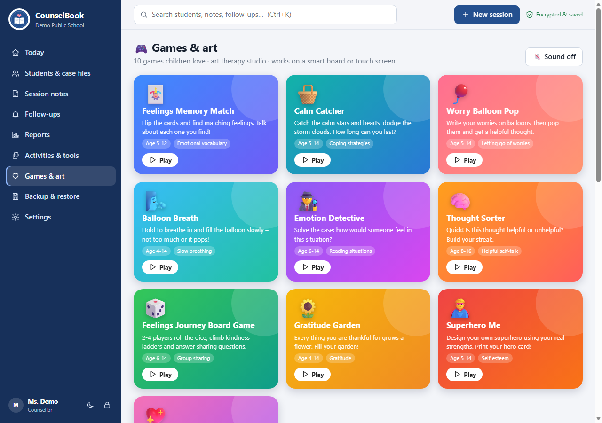
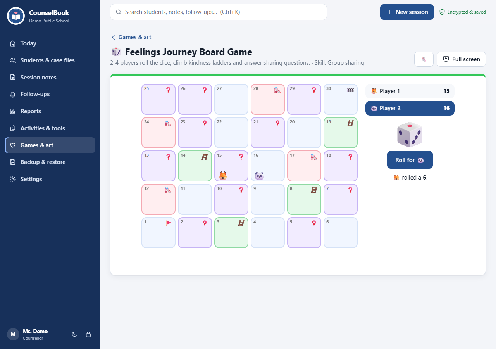
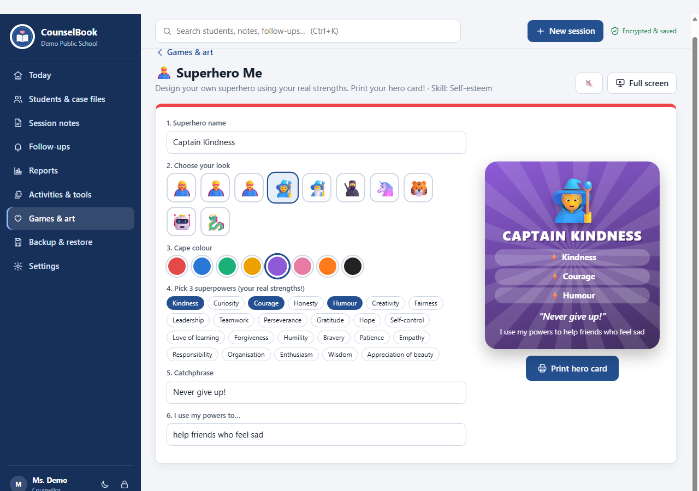
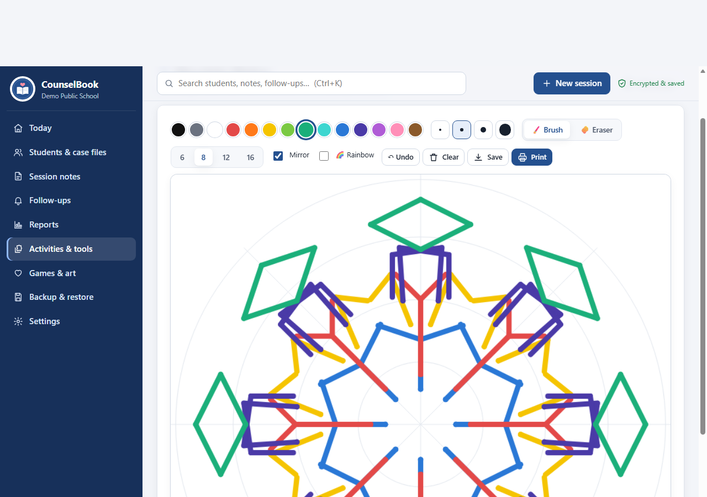

<p align="center">
  
</p>

<h1 align="center">CounselBook</h1>

<p align="center">
  <b>An offline, encrypted record book for school counsellors, with reports for school leaders and games for children.</b><br>
  Runs in Microsoft Edge on any Windows PC. Nothing to install, no internet, no server.
</p>

<p align="center">
  
</p>

---

## Why CounselBook?

School counsellors often keep notes in diaries, spreadsheets and loose forms. Reporting to the principal at the end of the year then becomes a long manual job. Many school computers are also locked down, so new software can't be installed.

CounselBook is a single folder of HTML, CSS and JavaScript that opens in the browser already on the PC. It keeps every record **encrypted on that computer** and turns the counsellor's daily work into clear, anonymised reports.

## Features

### Everyday work
- **Today screen**: who to meet today, overdue follow-ups, high-priority cases and this month's numbers at a glance
- **Students & case files**: name, class, contacts and parent number, plus a timeline of every session, follow-up and file
- **Session notes**: date, duration, type and issue tags, with **SOAP, DAP, GIRP or free-text** templates, quick phrases and next steps
- **Group sessions** with several students, or a whole-class workshop
- **Follow-up reminders**, exported to Outlook or Google Calendar as an `.ics` file
- **Priority flags** and **open / closed** case status
- **Search** across all students, notes and follow-ups (`Ctrl+K`)
- **Attachments**: photos of forms and letters, or PDFs, stored encrypted
- **Archive** students who have passed out, plus a **year rollover** that promotes every class

### Presenting to school leaders
- Charts of monthly sessions and hours, issues, classes, session types and referral sources
- **"Present to seniors"**: a full-screen slideshow built from the live numbers
- **Anonymised year-end report** saved as a PDF (no student names)
- **Single-student history** exported as a PDF
- CSV export for Excel

<p align="center"></p>

### Logins & privacy
- **Admin** and **Counsellor** logins are created during first-run setup
- The admin can create more logins and choose, **section by section**, between *No access*, *View* and *Edit*
- Ready-made roles: Counsellor, Principal / Senior (reports only, names hidden), Assistant / Class teacher, Custom
- Per-login switches for **"Hide student identities"** and **"Can read confidential notes"**
- An activity log of sign-ins and important changes

### Security
- All data is encrypted with **AES-256-GCM** using the browser's built-in Web Crypto
- Each login unlocks the data with its own password or PIN (PBKDF2-SHA256, 200,000 iterations)
- A **recovery key** is created at setup in case the admin forgets their password
- The app **auto-locks** after a period of inactivity; `Ctrl+L` locks it at once
- **Encrypted backups** can be saved to a USB drive or a Google Drive folder
- Makes **no network requests**; data never leaves the computer

### 60 counselling activities
Activities with steps, debrief questions and **printable worksheets**, covering emotions, stress and anxiety, self-esteem, friendships, bullying, conflict, study skills, careers, goal setting, mindfulness, family, digital wellbeing and **art therapy**. Any activity can be logged as a session in one click.

<p align="center"></p>

### Games & art for children
Ten games built for a smart board or touch screen, each tied to a social-emotional skill:

| Game | Skill |
|---|---|
| 🃏 Feelings Memory Match | Feeling words |
| 🧺 Calm Catcher | Coping strategies |
| 🎈 Worry Balloon Pop | Letting go of worries |
| 🌬️ Balloon Breath | Slow breathing |
| 🕵️ Emotion Detective | Reading situations |
| 🧠 Thought Sorter | Helpful self-talk |
| 🎲 Feelings Journey Board Game (2–4 players) | Group sharing |
| 🌻 Gratitude Garden | Gratitude |
| 🦸 Superhero Me | Self-esteem |
| 💖 Kindness Quest | Social choices |

Plus two **art therapy** tools:
- **Mandala Maker**: mirrored drawing in 6 to 16 segments
- **Art Studio**: brush, paint bucket and eraser, with templates (inside/outside mask, heart map, feelings jar, body map, inner weather, bridge drawing, comic strip, worry monster, safe place)

The games save no child data, only high scores on that computer.

<p align="center">
  
  <br>
  
  
</p>

## Getting started

1. **Download** this repository (green **Code** button → **Download ZIP**) and unzip it, for example to `D:\CounselBook`. Keep all the files together.
2. Double-click **`Start CounselBook.bat`**. It opens the app in Microsoft Edge in app mode.
3. *(Optional)* Double-click **`Create Desktop Shortcut.bat`** to add a CounselBook icon to the desktop.
4. On first run, enter the **school name** and create the **Admin** and **Counsellor** logins.
5. **Write down the recovery key** that appears. It is shown only once.

Tick *"Add a few sample students"* during setup to explore with demo data. You can remove it later in **Settings**.

> **Requirements:** Windows 10 or 11 with Microsoft Edge (pre-installed). Google Chrome also works. No admin rights, installation or internet connection needed.

### Using your own logo
Replace `assets/logo.jpg` with your school's logo (a square image works best). It appears on the login screen, as a faint background watermark, and on printed reports.

## Where is the data stored?

The launcher opens Edge with a private profile at `%LOCALAPPDATA%\CounselBook`. Records are kept, encrypted, in that profile's IndexedDB. Clearing your normal Edge history will **not** delete them.

Because the data lives on one computer, **back up regularly**: open **Backup & restore → Create encrypted backup** and save the file to a USB drive or a Google Drive folder. To move to a new PC, copy the app folder there, choose **Restore**, and sign in with a login from the backup.

## Project structure

```
counselbook/
├── index.html                 App shell
├── Start CounselBook.bat      Launcher (Edge app mode, private profile)
├── Create Desktop Shortcut.bat
├── README.txt                 Plain-text guide for counsellors
├── assets/logo.jpg            School logo
├── css/app.css                All styles (light/dark, print)
├── js/
│   ├── store.js               IndexedDB + AES-GCM encryption, key wrapping
│   ├── ui.js                  Icons, modals, toasts, SVG charts, date helpers
│   ├── core.js                State, logins, permissions, shell, router, printing
│   ├── views-main.js          Setup, Today, Students, Case file, Sessions, Follow-ups, Search
│   ├── views-more.js          Reports, presentation, Activities, Games page, Users, Settings, Backup
│   ├── activities-data.js     60 activities and worksheet definitions
│   ├── tools.js               Classroom tools + Mandala Maker / Art Studio
│   └── games.js               10 children's games
└── docs/screenshots/
```

Everything is plain JavaScript in classic `<script>` files, with no build step, framework or external dependencies. This is deliberate: the app has to work from `file://` on computers that block downloads.

## Development

There is nothing to build. Edit the files and reload the page.

- Open `index.html` directly in Edge or Chrome, or serve the folder with any static server.
- Classic scripts only. ES modules are blocked on `file://`.
- Don't add CDN links. The app must work offline.

## Known limitations

- **Fingerprint / face unlock** isn't available to an offline page; use a password or 6-digit PIN.
- **Voice typing** buttons use the browser's speech service, which needs internet. Offline, press **Windows key + H** in any text box to use Windows' built-in dictation.
- Data is stored per computer and per Windows user. Use encrypted backups to move or share it.

## Privacy note

CounselBook is designed for sensitive student information. Nothing is sent anywhere. Reports for school leaders are anonymised by default, and session notes can be marked **confidential** so that only permitted logins can read them. Follow your school's and country's data-protection rules when deciding who gets a login.
